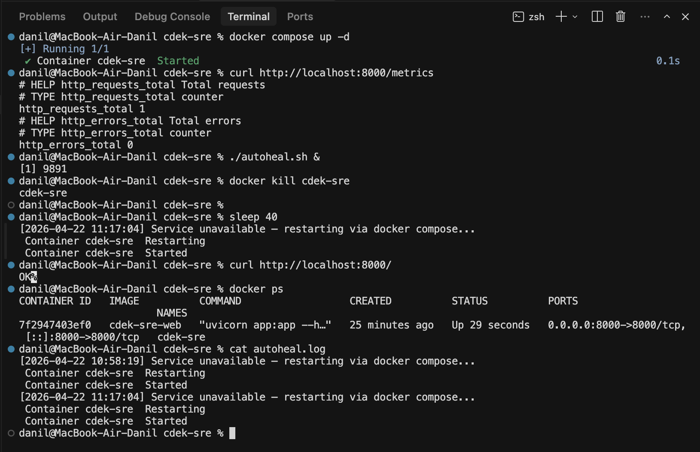

# Тестовое задание SRE CDEK

## Структура проекта

```
app.py                       FastAPI-приложение
requirements.txt             Python-зависимости
Dockerfile                   Сборка Docker-образа
compose.yml                  Docker Compose конфигурация
autoheal.sh                  Скрипт автоматического восстановления
.github/workflows/ci.yml     CI-пайплайн GitHub Actions
README.md                    Документация и ответы на вопросы
```


---

## Ответы на вопросы

### 1. Какие ещё метрики вы бы добавили для этого сервиса в production?

1. `http_request_duration_seconds` (histogram) - распределение времени ответа на запросы. Позволяет вычислять перцентили (p50, p95, p99) и отслеживать деградацию производительности.

2. `http_requests_in_progress` (gauge) - количество запросов, обрабатываемых прямо сейчас. Помогает обнаружить перегрузку сервиса и зависшие соединения.

3. `process_resident_memory_bytes` (gauge) - потребление оперативной памяти процессом. Критично для обнаружения утечек памяти до того, как они приведут к OOM-kill.

4. `process_cpu_seconds_total` (counter) - суммарное время CPU, использованное процессом. Позволяет отслеживать аномальное потребление ресурсов.

5. `http_response_size_bytes` (histogram) - размер HTTP-ответов. Помогает выявить аномально большие ответы и спрогнозировать сетевую нагрузку.

### 2. Как вы проверили, что при падении контейнера он автоматически восстанавливается?

С параметром `restart: always` в `compose.yml`, Docker автоматически перезапускает контейнер при аварийной остановке процесса.

Важно: `docker kill <container>` - это ручная остановка контейнера, и в таком случае одного `restart: always` недостаточно. Для восстановления после `docker kill` в этом задании используется `autoheal.sh`, который проверяет доступность эндпоинта и делает `docker compose restart`.

**Команды для имитации падения и скриншот логов:**

```bash
docker compose up -d
curl http://localhost:8000/metrics        # должны быть метрики

# Запустить autoheal в фоновом режиме (лог появится только если скрипт запущен)
./autoheal.sh &

# Имитация падения
docker kill cdek-sre                      # имитация падения (ручная остановка)
sleep 40
curl http://localhost:8000/               # должно снова работать (autoheal выполнит docker compose restart)
cat autoheal.log                          # должна быть запись о перезапуске
```




### 3. SLI / SLO

SLI: доступность сервиса - доля успешных HTTP-ответов (статус < 500) от общего числа запросов.

```
SLI = (http_requests_total - http_errors_total) / http_requests_total × 100%
```

SLO: 99.9%

Расчёт допустимого простоя:

В месяце ≈ 30 дней × 24 часа × 60 минут = 43 200 минут
Допустимая недоступность = 43 200 × (1 − 0.999) = 43 200 × 0.001 = 43.2 минуты в месяц

Это означает, что сервис может быть недоступен суммарно не более 43.2 минут в месяц, чтобы соответствовать SLO 99.9%.

### 4. Постмортем (postmortem)

Инцидент: Сервис не отвечал 15 минут из-за утечки памяти

Дата: 2026-04-20, 14:30–14:45 UTC+7

Причина: В обработчике запросов накапливались объекты в глобальном списке, который не очищался, что привело к исчерпанию доступной памяти контейнера и его принудительному завершению. `restart: always` перезапускала контейнер, но он снова падал через несколько секунд из-за быстрого роста нагрузки после восстановления.

Как обнаружили: Скрипт `autoheal.sh` зафиксировал серию перезапусков в `autoheal.log`. Алерт на метрику `process_resident_memory_bytes` показал линейный рост до порога OOM.

Как исправили: Остановили трафик, исправили код - заменили растущий список на счётчик. Развернули исправленную версию, после чего сервис стабилизировался.

Меры для предотвращения:
- Добавили лимит памяти в `compose.yml` (`mem_limit: 256m`), чтобы OOM-kill происходил раньше и предсказуемо.
- Настроили алерт: если `process_resident_memory_bytes` превышает 200 MB в течение 5 минут - уведомление в дежурный канал.
- Добавили в CI нагрузочный тест, проверяющий отсутствие роста памяти при 1000 последовательных запросах.
